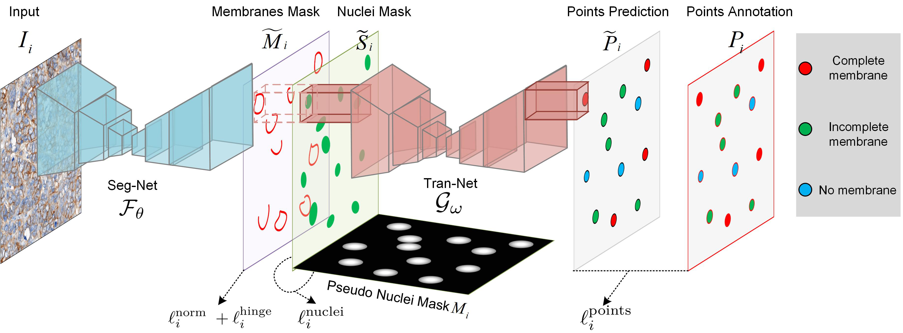
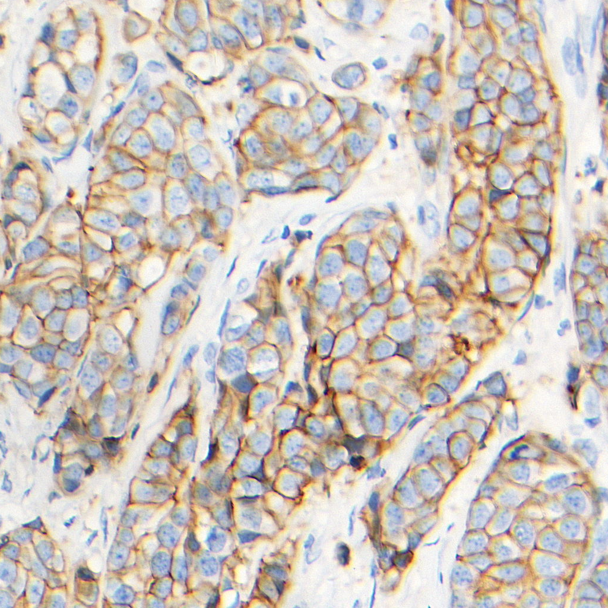
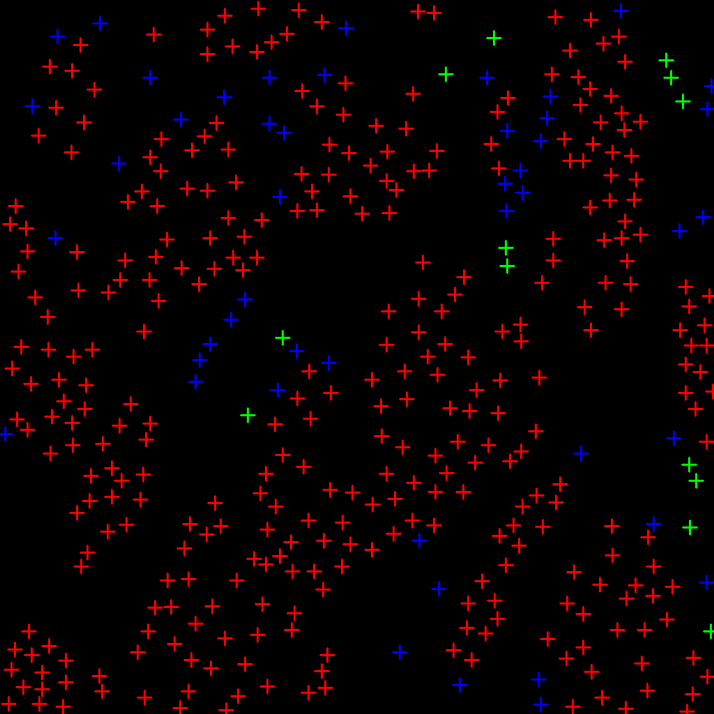

# Segment Membranes and Nuclei from HistopathologicalImages via Nuclei Point-level Supervision

This repository contains the pytorch code for the paper:

Segment Membranes and Nuclei from Histopathological Images via Nuclei Point-level Supervision, MICCAI2023. ([PDF](https://doi.org/))

## Citation

If you find this code useful in your research, please cite our work:

```
@inproceedings{Li2023miccai,
    author = "Hansheng Li, Zhengyang Xu, Yuxin Kang, Xiaoshuang Shi, Hong Lv, Ming Li, Mingzhen Lin, Lei Cui, Jun Feng, Wentao Yang and Lin Yang",
    title = "Segment Membranes and Nuclei from HistopathologicalImages via Nuclei Point-level Supervision",
    booktitle = "Medical Image Computing and Computer Assisted Intervention -- MICCAI 2023",
    year = "2023",
    pages = "undetermined",
}
```

## Introduction
Accurate quantification of immunohistochemistry (IHC) membrane staining images are crucial for cancer diagnosis and prognosis.
However, there have been relatively few studies conducted on the segmentation of IHC membranes, and have a significant drawback: it necessitates pathologists to take substantial time and effort for pixel-level annotations. 
To address this, we propose a novel deep framework for membrane segmentation that utilizes nuclei point-level supervision, achieving performance comparable to fully supervised methods.
Our framework consists of two networks: a Seg-Net that generates segmentation results for membranes and nuclei and a Tran-Net that transforms the segmentation into semantic points.
Experiments on two IHC membrane-stained datasets show that our method achieved an 81.36% IoU and 85.51% F1 score of the fully supervised methods. 





## Dependecies
In the environment configuration, we primarily utilize `torch==1.5.0`.
For further details, please refer to `requirements.txt`.

## Usage

### Data preparation
Before training, you need to prepare the training images and ground truth. 
For the ground truth, each labeled point carries both position and the staining state of the cell membrane information. 
The position information refers to the coordinate of centroid of cells, while the staining state of the cell membrane include complete membrane, incomplete membrane and no membrane.

As an example from our dataset, we visualize the ground truth using colored-coordinates.
In this visualization, red represents complete membrane, blue represents incomplete membrane, and green represents no membrane.
You can refer to the `prepare_data.py` file for data preprocessing. In this project, the goal is to convert point annotations and images into dictionary format and then save them as .h5 files.

| Image | ground truth |
| -----|-----| 
|  |  | 


### Model training and test

The code for this project was modified based on the repository at https://github.com/huiqu18/FullNet-varCE. It is recommended that future users also cite their article for reference.
```
@inproceedings{Qu2019miccai,
    author = "Hui Qu, Zhennan Yan, Gregory M. Riedlinger, Subhajyoti De, and Dimitris N. Metaxas",
    title = "Improving Nuclei/Gland Instance Segmentation in Histopathology Images by Full Resolution Neural Network and Spatial Constrained Loss",
    booktitle = "Medical Image Computing and Computer Assisted Intervention -- MICCAI 2019",
    year = "2019",
    pages = "378--386",
}
```
To training a model, set related parameters in the file `options.py` and run `python train.py`

To evaluate the trained model on the test set, set related parameters in the file `options.py` and run `python test.py`. 
